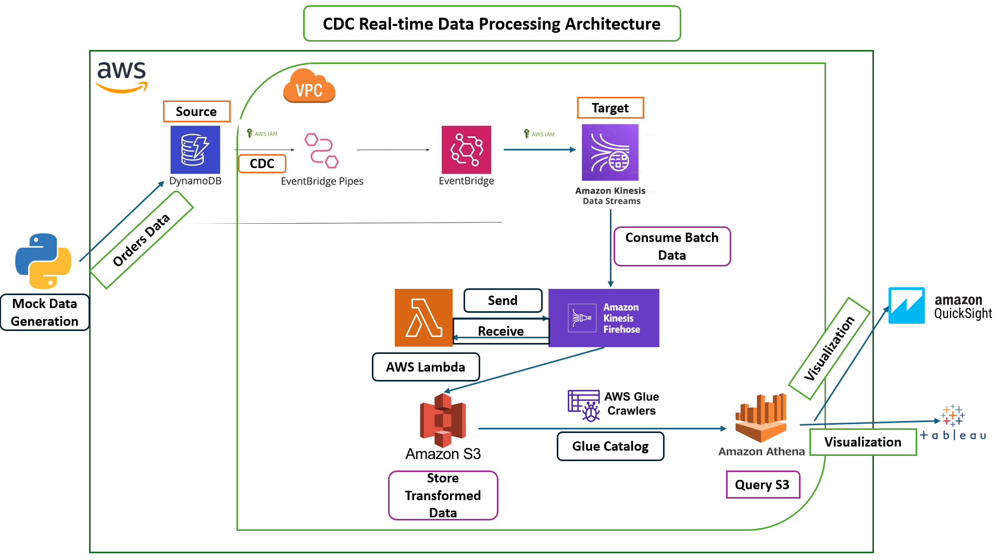

# Real-time CDC Data Processing for Sales Orders Fact

## Overview

This project focuses on processing real-time change data capture (CDC) from sales order transactions. The sales order data streams into DynamoDB tables, undergoes various transformations, and is finally stored in an S3 bucket in a Hive-style partitioning format. The processed data can then be queried and analyzed using AWS Glue, Athena, and visualized using tools like Tableau or QuickSight.

## Architecture Diagram

## Steps Involved

1. **Generate Mock Data**: Begin by creating a Python script to generate and stream mock sales order data into DynamoDB using the `boto3` library.

2. **DynamoDB Setup**: Create a DynamoDB table and enable data streams for CDC capture.

3. **Target Configuration**: Set up a Kinesis Data Stream as the target destination for the data from DynamoDB. Ensure appropriate IAM permissions are attached to read data.

4. **Event Bridge Configuration**: Create an EventBridge rule to flow data from DynamoDB to the Kinesis Data Stream. Configure the source as DynamoDB and the target as the Kinesis Data Stream created earlier.

5. **IAM Permissions**: Attach IAM policies to allow reading and writing data from DynamoDB and the Kinesis Data Stream.

6. **Start EventBridge Pipe**: Begin streaming data from DynamoDB to the Kinesis Data Stream by starting the EventBridge pipe.

7. **Kinesis Firehose Configuration**: Set up Kinesis Firehose to batch the near real-time data streaming from the Kinesis Data Stream. Configure the source as the Kinesis Data Stream and the transformation layer as an AWS Lambda function. The target should be an S3 bucket.

8. **Lambda Transformation**: Attach the Lambda function as the transformation layer to process the data before storing it in S3. This function performs necessary transformations on the data.

9. **Data Storage**: Kinesis Firehose batches the transformed data and stores it in the S3 bucket in Hive partitioning style.

10. **AWS Glue Crawler**: Create an AWS Glue Crawler to read metadata from the S3 bucket and create a Glue catalog.

11. **Glue Catalog Configuration**: Configure the Glue catalog in AWS Athena to query the data stored in the S3 bucket. Perform basic analysis on the processed data.

12. **Visualization**: Utilize Tableau or QuickSight for visualization of the analyzed data to derive meaningful insights and KPI metrics.

## Congratulations!

We have successfully completed the setup and processing of real-time CDC data for sales orders, enabling seamless querying and analysis of the processed data. Reach out to me if you face any issues during you setup "https://www.linkedin.com/in/sai-varun-kumar-namburi/"
